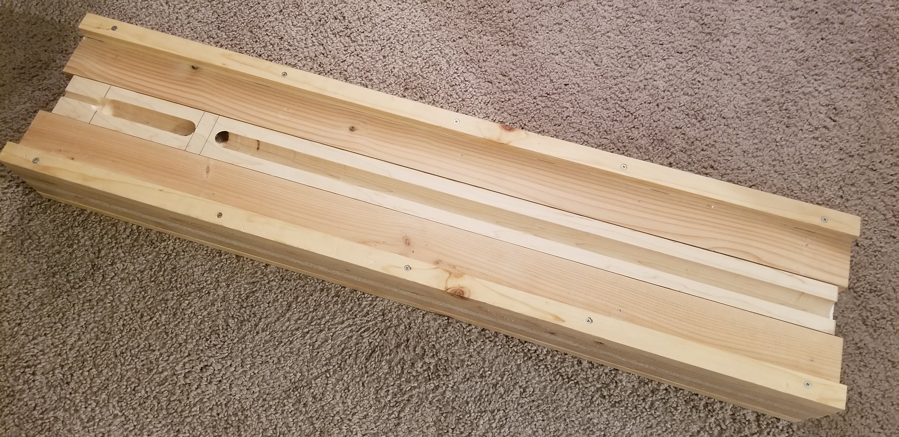
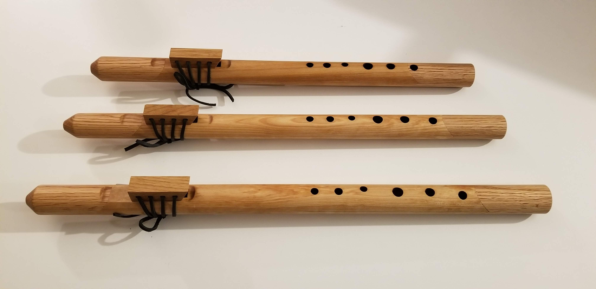
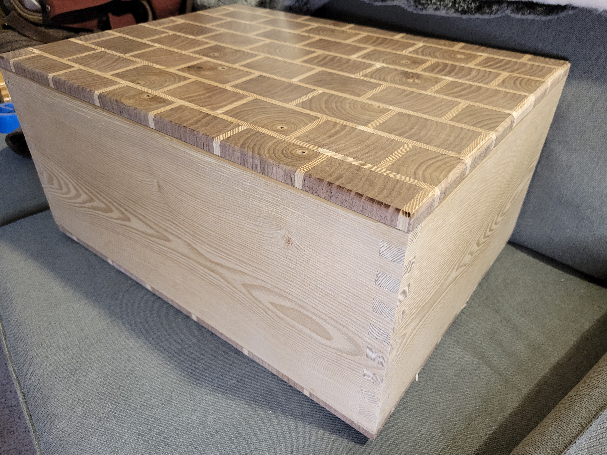

# CNC — CAM Programming and Haas Operator Skills

> *Self-taught CAM and Haas operator at Uniformity Labs — the only operator on the floor, no coach, two production CNC machines and a backlog of metal-printed parts that needed to come to drawing tolerance. Plus earlier personal CNC-adjacent fixturing for instrument-making.*


*Inside the Haas VF-2 mid-cut: coolant flooding a stainless workpiece in the vise, swarf settled on the chip pan to the right. This is the daily reality of post-processing AM parts — flood coolant, controlled feeds, and a lot of attention to whether the workholding will survive the cut.*

## What this is

A documentation repository for my CAM programming and CNC operator practice. Two threads:

1. **Uniformity Labs (Fremont, CA) — Metal 3D Print Specialist, 2022–2023.** I was the **only operator** on the Haas ST-20Y CNC turning center and Haas VF-2 vertical machining center. Self-taught from a blank slate. Daily work: turning AM-printed cylindrical blanks into ASTM E8 tensile specimens, machining sintered/SLM-printed parts to drawing tolerance, building work-holding fixtures for unusual print geometries.
2. **Personal CNC-adjacent work (2020–present).** Earlier CAM/jig work for instrument-making — flute-routing fixtures and instrument body features — plus the woodworking that surrounded it.

## The self-taught story

When I started at Uniformity Labs in 2022, the company had two Haas CNC machines on the floor and exactly zero operators. I learned to drive them by reading manuals, watching every Haas YouTube tutorial that existed, and accepting that the first parts off either machine were going to be exploration of the tool envelope, the work envelope, and my own competence.

It felt like learning to drive a Ferrari without any driving experience and without a coach.

There were a few small crashes. I did, exactly once, put a dent in the back interior wall of the VF-2 when a workpiece broke free from the jaws and used the spindle as a temporary bowling ball. *(Only once — pinky promise.)*

The lessons that stuck — and that I carry into every CNC setup since:

- **Workholding is everything.** The dent was a workholding failure, not a programming failure. Every fixture choice afterwards started with *"what does this part want to do when the cutter touches it, and what holds it against that?"*
- **Run the program in the air first.** Cycle through every tool change, every move, with the table dropped or the spindle retracted. It catches everything except feeds and speeds.
- **Tooling and feeds matter more than CAM cleverness.** A boring CAM strategy with the right tool and the right feed-and-speed will out-perform a clever toolpath with marginal tooling every time.
- **Document the post-processor quirks.** The Haas dialect of G-code has its own surprises, and the tribal knowledge lives in your notebook or it dies with the operator.

## Equipment operated

### Haas ST-20Y CNC turning center

*The ST-20Y at Uniformity. Y-axis turning center — used daily for finishing AM-printed cylindrical blanks into ASTM E8 sub-size tensile specimens, plus general turned-part work for fixtures and assemblies. The Y-axis matters for off-center features; without it the ST-20Y would just be an ST-20.*


*Inside the ST-20Y mid-cycle: a workpiece (here, an AM-printed cylindrical tensile-specimen blank) held between three-jaw chuck (left) and live center (right), tool turret retracted at right between cuts.*

### Haas VF-2 vertical machining center

*The VF-2 at Uniformity. 3-axis VMC. Fixturing work, post-processing of AM parts that needed features beyond what the print could produce, and the machine that taught me the workholding lesson the hard way. The dent is on the back wall, lower right corner, and I won't be photographing it.*

## Workflow — AM-to-CNC post-processing

Typical part flow at Uniformity:

1. **Receive the AM-printed near-net part.** Rough sintered surface; +0.005" oversize on critical features by design.
2. **Inspect against the print model.** Identify which features need machining to spec — typically bores, mounting faces, threaded holes, and any datum surfaces.
3. **Generate CAM toolpaths** and post-process to Haas G-code.
4. **Build or pull workholding.** Vise jaws, soft jaws, custom fixtures. AM parts often have no flat references, which is half the problem.
5. **Run program in the air first.** Verify tool changes, work offsets, clearances. (See: lessons that stuck, above.)
6. **First-part run with reduced feeds.** Inspect against the drawing.
7. **Production run** if applicable.

### Work products


*The AM-to-CNC handoff: SLM-printed metal parts still on the build plate, with the rough sintered surface texture of as-printed LPBF. The CNC work is what brings their critical features to drawing tolerance — bores, mounting faces, threaded holes — without losing the geometry-freedom benefits of the AM process upstream.*


*Same batch, separated from the build plate. Each part will see the VF-2 next.*


*A finished aluminum part off the ST-20Y — clean external profile, internal counterbore, lathe-finished surface. Photographed sideways because that's how it came off the chuck.*

## Personal CNC + CAM-adjacent work

Pre-Uniformity, my CAM-adjacent work centered on instrument-building fixtures rather than production CNC. The shape of the thinking transferred — what's the part, what holds it, what tool makes the cut, what's the order of operations — but the equipment was a router table and hand tools instead of a Haas.


*A wooden routing jig under construction for the slow-air-chamber + true-sound-hole cuts on Native American style flutes. The first time I designed a fixture from "what features does the part need" rather than "what fits in my vise." Two months later, the flutes coming off this jig:*




*Adjacent woodworking from the same era — segmented end-grain top, dovetail-joined sides. Same part-and-fixture thinking applied at the woodworking bench rather than the CNC.*

## Sister projects

- **[tensile-testing](https://github.com/tonykoop/tensile-testing)** — the tensile-testing methodology and DoE framework that the AM-blank-to-specimen turning supported.
- **[additive-manufacturing](https://github.com/tonykoop/additive-manufacturing)** — the LPBF process side of the Uniformity Labs work. CNC was the downstream finish step that brought AM-printed parts to drawing tolerance.
- **[metal-powder-flow-device](https://github.com/tonykoop/metal-powder-flow-device)** — a custom scientific instrument I designed and CNC-machined at Uniformity Labs for powder flow characterization.
- **[flutes](https://github.com/tonykoop/flutes)** — the instrument repository where the personal flute-routing fixture work fed into the build process.

## What this repository is for

- **Skills demonstration.** CAM programming + Haas operator + workholding/fixturing + AM-to-CNC post-process — the manufacturing toolkit a senior R&D mechanical engineer needs when no one else on the floor speaks G-code.
- **Honest learning record.** The Ferrari-without-a-coach origin story, the VF-2 dent, the workholding lessons. Hiring managers trust engineers who own their mistakes more than ones who don't.
- **Cross-references.** Anchors the CAM/CNC dimension of work that's only briefly mentioned in the sister repositories above.

## Repository structure

```
cnc/
├── README.md                  ← you are here
├── LICENSE                    ← CC-BY 4.0 (scoped to original content only)
└── images/                    ← machine, work-product, and personal-project photos
```

## Status

| Section | Status |
|---|---|
| Repo description, license | ✓ done |
| Equipment narrative + photos | ✓ done |
| Self-taught story | ✓ done |
| Workflow + work-product photos | ✓ done |
| Personal CNC-adjacent work | ✓ done |
| Specific CAM software documentation (Fusion 360 / HSMWorks / Mastercam — TBD) | forthcoming |
| Workholding + fixturing case studies | forthcoming |

## License

Released under [CC-BY 4.0](LICENSE) — original written content and photographs in this repository are mine, free to reuse and adapt with credit. **Any CNC programs, toolpaths, post-processor configurations, or fixture designs developed for past employers remain proprietary to those employers and are not included here.**
